# Build an open standard data Lakehouse by using Azure Synapse Analytics and Azure Databricks

**The estimated time to complete this lab is 45 minutes.**

  

  

## Table of contents

1. [Exercise 1: Data ingestion from a spectrum of analytical and operational data sources into the Lakehouse. ](#data-ingestion)
	- [Task 1.1: Explore a Streaming data and analytics pipeline using ADX for a near real time analytics scenario.](#streaming-data)
	- [Task 1.2: Explore a few Synapse pipelines that ingest raw data from analytical data sources to the Bronze layer of the Data Lake.](#analytical-sources)
	- [Task 1.3: Explore a few Synapse pipelines that ingest raw data from operational data sources to the Bronze layer of the Data Lake.](#operational-sources)
2. [Exercise 2: Explore offline data and analytics pipeline using open Delta format and Azure Databricks Delta Live Tables. Stitch streaming and non-streaming data landed earlier to create a combined data product to build a simple Lakehouse.  ](#delta-live-table-pipeline)
    - [Task 2.1: Set up Azure Databricks environment.](#adb-env)
	- [Task 2.2: Review sentiment analysis model training.](#sentiment-model)
	- [Task 2.3: Create a Delta Live Table pipeline.](#dlt-pipeline)
3. [Exercise 3: Explore Machine Learning and Business Intelligence scenarios on the Lakehouse.](#data-science-and-analytics-on-the-Lakehouse)
	- [Task 3.1: Review MLOps pipeline using the Azure Databricks managed MLflow. ](#ml-model-using-ml-flow)
	- [Task 3.2: Leverage Power BI to derive actionable insights from data in the Lakehouse. ](#power-bi-report-to-analyse-data-in-the-Lakehouse)
	- [Task 3.3 (OPTIONAL): Explore SQL Analytics with Azure Synapse Serverless.](#sql-analytics-with-synapse)
	- [Task 3.4 (OPTIONAL): Explore SQL Analytics with Azure Databricks.](#explore-sql-analytics-with-azure-databricks)
4. [Exercise 4: Glimpse of Purview to govern the overall data and analytics estate.](#tee-up-the-purview)  

----

This lab explores an end-to-end implementation of an open standard data Lakehouse. You have the opportunity to explore raw data ingestion from disparate data sources that transforms data by using Delta Live Tables in Azure Databricks. The ingestion creates data products that can be further leveraged by data science, machine learning, and business intelligence applications.
This lab will demonstrate the capability of Lakehouse to serve as a single platform for managing and supporting data and analytics needs.
You will work through an example of a real world implementation for the fictitious Wide World Importers Enterprise.

Wide World Importers is a brick-and-mortar retailer that has hundreds of stores worldwide and a fast-growing online store. It sells a wide variety of consumer merchandise, including sunglasses, sports shoes, watches, wallets, books, and various beach products.

The lab scenario starts on May 30th, 2021. The company's new CEO, April, recently noticed negative trends in their KPIs, including:

- High customer churn
- Declining sales revenue
- High bounce rate on their website
- Poor customer experience

In a purely reactive mode, as soon as the company saw these adverse KPI trends, they launched some traditional campaigns. On September 5 (Labor Day), the results of those campaigns were received. The company noticed that the campaigns failed to be effective.

So, April talked with Rupesh, the chief data officer (CDO), about these adverse KPI trends and recommended a data-driven approach.

In this Exercise you will act as a Data Engineer. Rupesh would like you to improve the above KPIs using the following requirements:

- Leverage data from the past, present, and future (Volume).
- Enable quick turnaround time (Velocity).
- Support open standards data format (Variety).

Here is the visual representation of the exercise that we are going to perform in this lab.

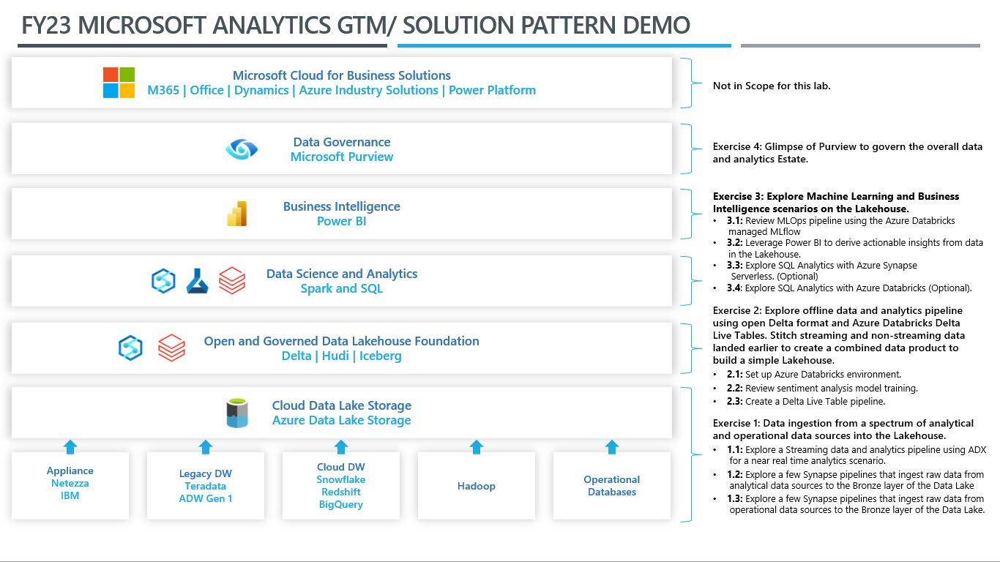
 
---
 

### Exercise 1: Data ingestion from a spectrum of analytical and operational data sources into the Lakehouse. 

As the data engineer at Wide World Importers, you will start by landing data from a variety of sources into the Lakehouse. This data will be further cleansed, processed, and conformed by using Azure Databricks and Delta Live Tables. You will prepare the data for downstream consumption by data scientists and business intelligence analysts. Data sources include data related to its customers, products, marketing campaigns, social media, and sales transactions. This data is often generated in raw files format such as CSV, JSON, unstructured files, and even images. A lot of existing data is historical data.

To boost customer satisfaction, gain a competitive advantage, and ultimately drive revenue growth, Wide World Importers wants to analyze the data to obtain meaningful insights related to their customers, marketing campaigns, and sales forecasts. However, their immediate challenge is to generate and use near real-time streaming data. So, they installed IoT devices in their stores to track customer shopping patterns and thermostat readings. They also set up Azure Data Explorer (ADX) with anomaly detection to correlate in-store traffic and store temperatures. As a result, they now have a large volume of real-time streaming data related to in-store traffic, temperature readings and anomaly detection.

In this exercise, you will explore how to ingest near real-time data into the Lakehouse and derive meaningful insights.

#### Task 1.1: Explore a Streaming data and analytics pipeline using ADX for a near real time analytics scenario. 

Wide World Importers wants its customers to have a pleasant in-store shopping experience. Maintaining the optimal temperature in stores and wine coolers is one way to accomplish this objective.

Consider that the Black Friday Sale in-store event has just started at 6:00 AM EST, and customers are arriving in large numbers at the Miami store. As described earlier, thermostat data from the stores is streamed in real-time to an Azure Event Hub and then into an Azure Data Explorer (ADX) pool for analysis.

In this task, you will use ADX to explore thermostat data from the stores streamed in near real time to an Azure Event Hub.

1.	Open Edge.

2.	Navigate to Azure Portal at https://portal.azure.com/

3.	Under the **Resources** tab, you will find the login credentials for your lab session. 

4.  Use the **Username** and **Password** to log into the Azure Portal.

5. If prompted to stay signed in, select **Yes**.

6. If prompted to take a tour, select **Maybe Later**.

7. In the search results pane, select **Resource groups**.

8. In the **Resource groups** page, in the filter box, enter: **analyticsSolution**.

9.	In the filtered results, select the resource group that has a name starting with **analyticsSolution-**.

  >**Note:** Each student has their own unique instance of this resource.

10. In the resources filter box for resources, search for **app**.

11. In the filtered results, select the App Service.

12. Select **Browse** (on the top left )

*This action will start the data simulation required to execute this task successfully*.

>**Note:** You will be redirected to a new web session (tab) with the **error 404 (Page Not Found)** .

13. Return to the Azure Portal session.

14.	In the resources filter box for resources, search for **Synapse**.

15.	In the filtered results, select the Azure Synapse resource.

*Note: You might see Synapse workspace resource name with a different suffix in your Azure Portal.*

16. In the Open Synapse Studio tile, select the Open link.

>**Note:** Synapse Studio opens in a new web session (tab).

17.	In Synapse Studio, at the left, select the **Data** hub icon (the second from the top).

18.	In the **Data** pane, expand **Data Explorer Databases (Preview).**

19.	Expand the **ignitekustopool** Data Explorer pool.

20. Select the **ellipses** (the three dots next to the data explorer pool).
>**Note:** If you do not see the ellipses, expand the Data pane by dragging it to the right. 

21. Select **Open in Azure Data Explorer**.

*This will open Azure Data Explorer in a new web session (tab).*

*For this lab, an ADX pool has already been created in the Azure Synapse workspace.*

*By using ADX’s powerful Kusto Query Language (KQL), you can ensure that the thresholds you have set for each device in the store is being met.*

>**Note:** Other Azure services use KQL for analytical queries. These services include Azure Monitor logs, Application Insights, and Microsoft Defender for Endpoint.

22.	In Azure Data Explorer Studio, in the left pane, select the **Data** hub icon.

23.	In the **Data Management** page, select the **Ingest data** action.

24.	In the **Destination** tab, in **Cluster** dropdown list, select the Data Explorer pool.

>**Note:** If you do not see any Data Explorer Pool in **Cluster** dropdown, select **Add Cluster**.

> 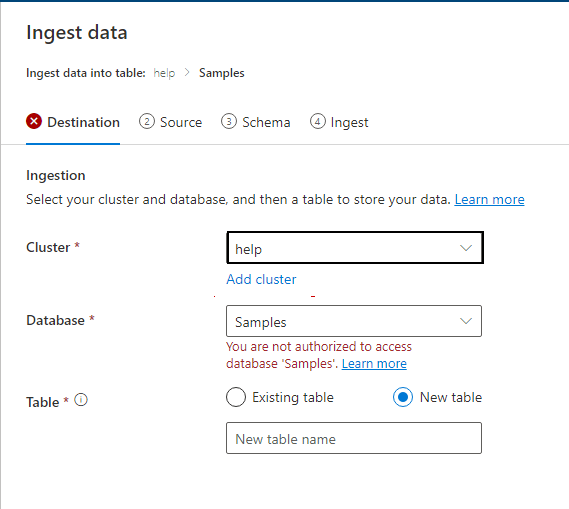

> Navigate to the Azure Synapse web session (tab), select **Manage** hub from the left pane.

> Select the **Data explorer pools (preview)** from the **Analytics pool** pane.

> Select the **igniteKustopool-**.

> 

> Under the **Query endpoint** copy the **URL** and select **Close** to close the pane.

> 

> Go back to the data explorer tab, in the **Connection URI**, enter the URI copied above.

> Select **Add**.

> 
     
25.	In the **Table** box, enter **Thermostat**.

26.	Select **Next: Source.**

27.	In the **Source** tab, in the **Source** dropdown list, select **Event Hub**.

28.	In **Subscription** dropdown list, select your subscription.

29.	In the **Event Hub namespace** dropdown list, select Event Hub that has a name starting with **adx-thermostat-occupancy-**.

30.	In the **Event Hub** dropdown list, select **thermostat**.

31.	In **Data connection name** dropdown list, select **IgniteDB-thermostat**.

32.	In the **Consumer group** dropdown list, select **$Default**.

33.	In **Compression** dropdown list, select **None**.

34.	Select **Next: Schema**.

35.	In the **Schema** tab, wait until the data preview loads (about 20 seconds).

36.	Review the event data, which comprises thermostat measures from different devices.

37.	In the **Data** format dropdown list, select **JSON.**

38.	Select **Next: Start ingestion.**

39.	Confirm that the continuous ingestion from Event Hub has been established, and then select **Close** (located at the bottom of the page).

40. Return to the Synapse Studio web session (tab).

41. In Synapse Studio, at the left, select the **Develop** hub icon (the third from the top).

42. In the **Develop** pane, expand **KQL scripts**.

43. Select the **ThermostatOccupancyScript** script.

44. In the **Connect to** dropdown list, select the data explorer pool.

>**Note:** If required, collapse the panes on the left using the << icon at the top right of each pane.

45. In the **Use database** dropdown list, select **IgniteDB**.

46.	Select the query (lines 4-8) that is commented as **What is the average temp every minute?**.

*The query retrieves the average temperature per minute for a thermostat device (TH005) for the Miami store.*

47.	Select **Run**. 

48.	In the **Results** pane (located along the bottom), review the query result expressed as a chart.

*Your graph may appear slightly different than the one shown above. It may take up to 60 seconds to load.*

49.	Notice that the temperature in the Miami store is oscillating between 65 and 70 degrees Fahrenheit. Also notice, that as soon as any unanticipated spike occurs in the store temperature, it is automatically cooled down using ADX.

---

  

#### Task 1.2: Explore a few Synapse pipelines that ingest raw data from analytical data sources to the Bronze layer of the Data Lake. 

  
Your next challenge is to ingest historical data from a spectrum of data sources.  

In this task you will ingest campaigns data from Snowflake and customer churn data from Teradata into the data lake.

1. Return to the Synapse Studio web session (tab).

2. In Synapse Studio, at the left, select the **Integrate** hub icon (the fourth from the top).

3. In the **Integrate** pane, expand **Pipelines**.

4. Expand the **1 Enterprise Data Sources In The Lake** folder.

5. Expand the **Landing Analytical Store Data** folder.

6. Select the **Campaigns Data From Snowflake** pipeline.

>**Note:** If required, collapse the panes on the left using the << icon at the top right of each pane.

*The ***Campaigns Data from Snowflake*** pipeline has two activities. The first one runs a lookup of data at the source Snowflake connection. The next activity brings that data into the Bronze layer in ADLS Gen2.*

7.	In the pipeline designer, select Lookup activity.

8.	In the pane below, select the **Settings** tab.

9.	In the **Source dataset** dropdown list, notice that **SnowflakeTable** is selected.

10.	In the pipeline designer, select **Copy data** activity.

11.	In the pane below, select the **Sink** tab.

12.	In the **Sink dataset** dropdown list, notice that **SnowflakeCampaignsData** is selected.

*Similarly, the next pipeline is designed to ingest customer churn data from Teradata and Twitter data to the data lake.*

>**Note:** The image is for informational purposes only. Due to time constraints, we will not explore it in the lab.

----

  

#### Task 1.3: Explore a few Synapse pipelines that ingest raw data from operational data sources to the Bronze layer of the Data Lake. 

  
In this task, you will explore the design of a Synapse pipeline that is designed to ingest raw data coming from various operational sources into the data lake.

1.	In the **Integrate** pane, in the **Landing Operational Store Data** folder, select the **Store Transactions Data from SQL DB** pipeline.

*The **Store Transactions Data from SQL DB** pipeline has two activities. The first one runs a lookup of data at the source Azure SQL Database connection. The next activity brings that data into the Bronze layer in ADLS Gen2*.

>**Note:** If required, collapse the panes on the left using the << icon at the top right of each pane.

2.	In the pipeline designer, select the Copy data activity.

3.	In the pane below, select the **Sink** tab.

4.	In the **Sink dataset** dropdown list, notice that **DestinationDataset** is selected.

*Similarly, the next pipeline is designed to ingest Sales data from Oracle to the data lake.*

>**Note:** The image is for informational purposes only. Due to time constraints, we will not explore it in the lab.

Congratulations! As a data engineer you have successfully ingested streaming near real time as well as historical data into data lake for Wide World importers.

-----------

### Exercise 2: Explore offline data and analytics pipeline using open Delta format and Azure Databricks Delta Live Tables. Stitch streaming and non-streaming data landed earlier to create a combined data product to build a simple Lakehouse. 

Analyzing disparate data sources in an integrated way has been a challenge for Wide World Importers. In the past, different teams at the company were assigned to analyze customer churn, social media trends, marketing campaigns, and sales forecasts. So, it was left to business analysts and executives to synthesize these datasets into a data-driven decision making solution. By delivering a Lakehouse, it will become simple for teams to collaborate on a unified workspace to process, analyze, and model data.

In this exercise, you will stitch two sets of data together to generate actionable insights. You will set up an Azure Databricks Delta Live Table (DLT) pipeline to build a simple Lakehouse. The pipeline will enrich the data by scoring it with machine learning models to help better understand customers and how to reduce churn.

The data source for the pipeline is the Bronze layer in ADLS Gen2, which was loaded by the Synapse pipeline in Exercise 1. This Bronze layer contains campaigns data, customer churn data, store transactions data, sales data and Twitter messages.

#### Task 2.1: Set up Azure Databricks environment 

In this task, you will set up the Azure Databricks environment.

1.	In the Azure portal web session (tab), in the search box (located across the top of the page), enter: **Azure Databricks**

2.	In the search results pane, select **Azure Databricks**.

3.	In the **Azure Databricks** page, select the resource that has a name starting with **databricks**.

>**Note:** Each student has their own unique instance of this resource. Each Azure Databricks workspace is provisioned with a full-featured development environment.

4.	In the Azure Databricks resource page, select **Launch Workspace**.

*A new web session (tab) opens. You will then set up the Databricks compute ready to serve your workload.*

>**Note:** If you see an error, refresh the page. Continue to sign in with the credentials provided to you.

> 

>**Note:** If you see a pop-up, select **Close**.

5. Select **Workspace** from the left navigation pane.

6. Select the **ADB_Initial_Setup** workspace.

> **Note: DO NOT** run this script. 
> This image is for informational purposes only. 
> Due to time constraints, we will not run this notebook in the lab session.

*In exercise 1, we extracted data from a spectrum of data sources and landed it into ADLS Gen 2 data lake. To access this data from ADLS Gen2 data lake, we need to mount it on Azure Databricks filesystem. Executing this script will mount ADLS Gen2 to Azure Databricks.*

---

#### Task 2.2: Review sentiment analysis model training. 

In this task, you will explore the sentiment analysis model training notebook. This notebook is used to retrieve the model ID that’s used by the DLT pipeline for further data processing.

*Sentiment Analysis is a branch of Natural Language Processing where the text is contextually mined to identify and extract subjective information in source material to understand whether the underlying sentiment is positive, negative, or neutral.*

1.	To open a different workspace, at the left, select the **Workspace** icon.

2.	Select the **02_Twitter_Sentiment_Score_Pred_Custom_ML_Model** workspace.

> **Note: DO NOT** run this script.
> This image is for informational purposes only.
> Due to time constraints, we will not run this notebook in the lab session.

*Running this script will generate a ML model ID. This Model ID is used by the Delta Live Pipeline that we will create in the next task to perform ML operations on Twitter data.* 

---

#### Task 2.3: Create a Delta Live Table pipeline. 

In this task, you will create a Delta Live Table pipeline.

*Delta Live Tables (DLT) makes it easy to build and manage reliable data pipelines that deliver high-quality data on Delta Lake. DLT helps data engineering teams simplify ETL development and management with declarative pipeline development, automatic data testing, and deep visibility for monitoring and recovery.*

1.	At the left, select the **Workflows** icon.

2.	Select the **Delta Live Tables** tab.

3.	Select **Create Pipeline**.

4.	In the **Create pipeline** window, in the **Pipeline name** box, enter a name like **Delta Live Table Pipeline**.

5.	To set the **Notebook libraries** property, select the notebook icon (at the left).

6.	In the **Select a notebook** window, select the **03_Sentiment_Analytics_On_Delta_Live_Tables** notebook.

>**Note:** Due to time constraints, we will add only **03_Sentiment_Analytics_On_Delta_Live_Tables** notebook library to the pipeline in the lab session.

**(TO BE SKIPPED)** : *Similarly, we can repeat steps 5 and 6 to add the other three notebook libraries.* 
 
- 01_campaign_analytics_DLT
- Campaign Powered by Twitter
- Retail Sales Data Prep Using Spark DLT

      
7.	In the **Storage location** box, enter: **/mnt/delta-files/lakedb/**

8.	In the **Target** box, enter: **lakedb**

9. Select **Create**.

*Once you select **Create**, it will create the Delta Live Table pipeline with all the notebook libraries added to the pipeline.*

> **Note: DO NOT** select **Start**.

*If you click on **Start**, Databricks will start executing the pipeline which will take approximately 10 minutes.*

> **Note:** The following instructions are for informational purposes only. Due to time constraints, we will not start the pipeline in the lab session.

*The lab insrtuctor will share with you the pipeline lineage. Please follow the lab instructor to understand the pipeline lineage in detail.*

10. **Observe** the data lineage of Bronze, Silver and variety of Gold tables.

This pipeline is based on the medallion architecture, an extremely simple but powerful design pattern for organizing your Lakehouse.

**Bronze** data is usually raw, unprocessed data from the source systems.

**Silver** data is created by cleaning and organizing raw data for further analysis and exploration.

**Gold** data is the finished analytical products – star schema tables for BI applications, engineered features for ML models, and shareable data assets for third parties, Data Mesh architectures, and other downstream consumers.

As you can see in this diagram, all the data is first landed in the Lakehouse where it is further processed into different medallion layers as discussed earlier.

The Twitter sentiment and campaigns data is stitched together to create a combined data product which is further consumed in the next exercise for Machine Learning and Business Intelligence use cases.

This information can be then piped into Microsoft Purview as a part of an overall view of your Azure data estate. By being designed around simplicity, openness, and collaboration, the Lakehouse is an extremely powerful architecture for addressing the many unique and interesting problems of a modern cloud data stack ready to be leveraged by Wide World Importers.

Congratulations! As a data engineer, you have now set up a solid foundation of fully stitched data comprised of campaigns data and Twitter data from disparate sources including some key data transformations.

----

### Exercise 3: Explore Machine Learning and Business Intelligence scenarios on the Lakehouse. 

#### Task 3.1: Review MLOps pipeline using the Azure Databricks managed MLflow and Operationalized as an ML service in Azure ML

Now that we've ingested and processed our customer data, we want to undersand what makes one customer more likely to churn than another, and ultimately see if we can produce a machine learning model that can accurately predict if a particular customer will churn.

We would also like to understand our customer's sentiment, so as to create targeted campaigns to improve our sales.

*Architecture Diagram*

1. In the Databricks web session (tab), which you opened in Exercise 2, in the left pane, in the top dropdown list, select the **Machine Learning** persona.

*By default, the left pane appears in a collapsed state and only the icons are visible. You can hover your cursor over the pane to expand it to the full view.*

2. In the left pane, select the **Workspaces** icon (first icon), and then select the ML Solutions in OneBox workspace.

In this task, you won’t run any cells. Instead, you will explore select cells and review their outcomes.
The below scatter-plot chart, you can see the corelation between:

- customer churn rate,
- amount spent by the customer and
- number of months of patronage of the customer.

  As a result, you will find that the customers who spend large amount and customer who are patrons for many months have the lowest churn rate.

3. Review the **cmd 11** cell, and then review the output for **Exploratory Data Analysis**.

   

4. Review the **cmd 29** cell.

Using the Customer churn data, we create multiple Customer churn ML models.

The best among these multiple ML Customer churn models is selected and registered with Azure model registry.

**Operationalized as an ML service using MLOps in Azure ML/AI**.

5. Review the **cmd 44** cell to load Azure ML Workspace.

The MLflow plugin azureml-mlflow is used to deploy the Customer churn ML model to Azure ML. The deployed ML model will be used to predict Customer churn.

**Twitter Sentiment Score Custom ML Model**

*This model helps Wide World Importers analyze the sentiment of their customers based on what's trending on social media like Twitter. The popular social media sentiments can be used to create attractive campaigns for a targeted audience.*

6. In the left, select the small arrow to expand the sidebar, collapse the **Customer Churn Model** and select **Twitter Sentiment Score Model**.

   

7. Review the **cmd 75** cell for customer model train and validation.

   

*Here the Twitter sentiment model is trained for further consumption.*

**Campaign Analytics**

8. From the sidebar, select **Campaign Analytics**.

   

9. Review the **cmd 88** cell.

*Using the Twitter sentiment model we trained in cmd 75 cell, Wide World Importers decided to run various campaigns to reduce their customer churn and to increase their revenue.*

**Sales Forecasting**

10. From the sidebar, select **Sales Forecasting**.

    

To validate their approach to reduce churn and improve sales, Wide World Importers decided to use a sales forecasting model.

*You will now look at the scenario where you are forecasting sales using a Regression model and deploying it to Azure ML as a service using a model registered in Azure Databricks.*

11. Review the **cmd 127** cell where model deployment is created.

    

*The model gets deployed to Azure ML endpoint. It can be consumed further for predicting the sales for Wide World Importers.*

12. Review the **cmd 133** cell to see sales forecast using store data after the campaigns.

    

*All this analysis using MLOps enabled Wide World Importers to predict positive sales forecast and a successful year ahead*.

---

#### Task 3.2: Leverage Power BI to derive actionable insights from data in the Lakehouse. 

For the purposes of this task, the date is November 1. Wide World Importers now needs to prepare for a successful Cyber Monday Sale event. The good news is that the enriched datasets sourced from disparate data sources and the best performing model outputs have now been placed in the Lakehouse ready for consumption by Power BI.

In this task, you will work with Power BI to reveal some valuable insights.

1.	Open a new web session (tab), and then navigate to: **https://powerbi.com**

2.  If prompted, enter the email account provided to you, and then select **Submit**.

*You may be redirected to a set up page.*

3. If prompted, in the **Business phone number** enter:**1234567891**, select **Next**.

>**Note:** **DO NOT** check the checkbox at the bottom of the page.

4.	If prompted, select **Get Started**.

*You have now signed in to Power BI.*

5. In the Power BI service, in the **Navigation** pane (at the left), select **Workspaces** (second icon from the bottom).

6. In the workspaces pane, select **My Workspace**.

7. To upload a Power BI Desktop file, on the **New** dropdown menu, select **Upload**.

8.	Select the **Local File** tile.

9.	In the **Open** window, navigate to the **C:\labfiles\Packaging\artifacts\reports** folder, and then select the **IgniteDemoReport.pbix** file.

10.	Select **Open**.

11.	Notice that a Power BI report and dataset have been added to your workspace.

12.	To open the report, select the **IgniteDemoReport** report.

13. This report has three sections:
 - Churn Analysis
 - Campaign Analytics
 - Website Analytics
 

14.  Lets navigate to **Churn Analysis Tab,** where we analyze the Customer Churn. This report and other two reports in Power BI are coming from the data Lakehouse that we created in earlier exercises.

15. The top left Scatter Chart shows the customers. The black color in the legend represents the customers who are more likely to churn, and the blue color shows the customers who are less likely to churn.
You can notice that the churn rate is low when the customer tenure is high as well as they spend higher amounts.

16. With this insight, Wide World Importers decides to target customers with lesser tenure and lesser spend amounts through their new campaigns.

Now, let's go the Campaign Analytics. 

17.  Select the **Campaign Analytics** tab from the top right pane to navigate to the Campaign Analytics report.

18. In this Campaigns Analytics report, the Bar chart shows that the most popular campaigns launched are **gogreen** and **sustainablefashion**. 

19. Click on **Website Analytics** from the top right pane to navigate to the Website Analytics Report.

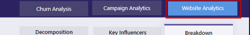

Here we see an immediate problem for Wide World Importers.
The bounce rate is high. Looks like a large population of their customers/visitors leave their website without much activity.

As per this Donut chart it seems that the bounce rate is high because around 60 % of the online Customers are not happy. 

Let us understand more about these **not happy** customers. What age group are they? What do they shop for and what devices they use to shop online? 

20. Click on **Not Happy** on the Donut chart to filter the report page.

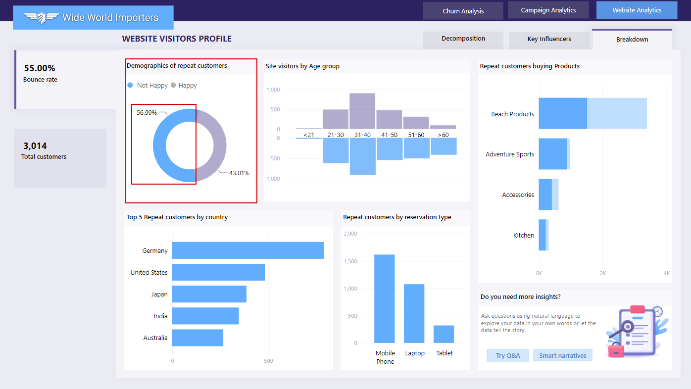
  
The **site visitors by age group** chart shows that most of the "Not Happy" Customers are in the  age group of 21 to 40. So, it seems, millennials form the majority of unhappy online customers. Now, let us see what these millenials typically shop for online.
 
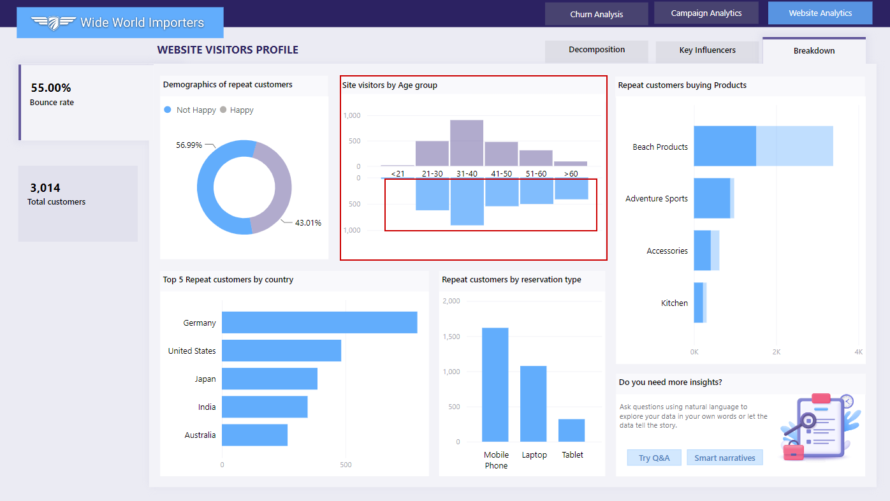 

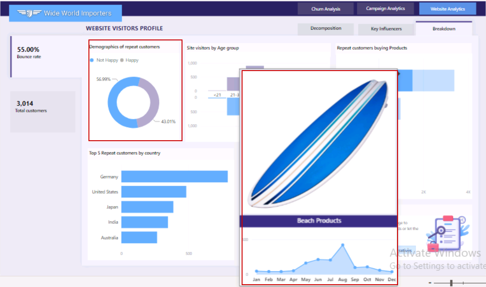

21.  We know that the millenials from the biggest customer segment are "Not Happy" when...

- they could not find the product they searched for on the website.
- Customers are also not happy when they were redirected to Wide World Importers website from a third party website.
- Customers are also not happy when the website user experience on their mobile phones is not good.
- they are not able find discounts on the website.

Ultimately, we can say that we need to improve the user experience on the website for product search and make sure it renders correctly on the mobile phone.
  
Now, lets navigate to the top customer segment for additional insights generated.

22. Click on the **Top Segments** to show the details.

23. Click on the first bubble 1 see the details for Segment 1.

94.5% customers are not happy.

94.5 % of the "not happy" customers experienced failed product searches. These are the millennials who are using their mobile devices for shopping.

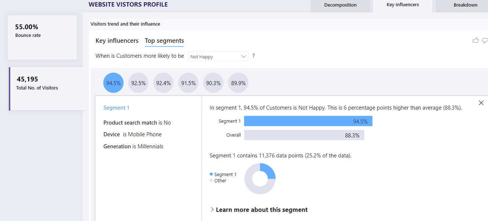
 

As a result of this analysis, Wide World Importers reduce their bounce rate by implementing a mobile-friendly website with fast product search, focussing on high demand product for the millenials.
These changes not only improve the bounce rate dramatically, but they also reward Wide World Importers with an uprecedented sales at their Cyber Monday Sale event. 

Now, let us see how on an ongoing basis, if there are any business needs to run adhoc time-critical queries, it can be achieved via custom queries. 

We will discuss that in more detail in the next task.

------------- 

#### Task 3.3 (OPTIONAL): Explore SQL Analytics with Azure Synapse Serverless. 

Data engineers are often required to support ad hoc and time-critical queries in addition to regular, scheduled reports.

In this task, you will learn how to perform custom SQL and business intelligence workloads on the data lake. You will query the data lake by using Azure Synapse Analytics. Specifically, you will rely upon Azure Synapse serverless SQL pools, which is a service that queries data in a data lake. It’s important to understand that the data can be queried without the need to move it into tables.

1. In the Azure portal web session (tab), in the search box (located across the top of the page), enter: **Synapse Analytics**

2. In the search results pane, select **Azure Synapse Analytics**.

3.	In the filtered results, select the Azure Synapse resource.

*Note: You might see Synapse workspace resource name with a different suffix in your Azure Portal.*

4. In the **Open Synapse Studio** tile, select the **Open** link.

*Synapse Studio opens in a new web session (tab).*

5. In Synapse Studio, at the left, select the **Develop** hub icon (the third from the top).

*In Synapse Studio, you can use T-SQL to directly query data in a data lake by using a serverless SQL pool. That way, you can achieve rapid data exploration.*

6. In the **Develop** pane, expand **SQL scripts**.

7. Select the **1 Query Campaign And Twitter Data Using TSQL Language** script.

*You can directly query external files stored in ADLS Gen2 storage without first copying or loading the data into a specialized store. You can query the data by using familiar T-SQL syntax.*

8. In the **Connect to** dropdown list, ensure that **Built-in** is selected. 

*You will use the built-in endpoint for this service that’s provided within every Azure Synapse workspace. It’s a Synapse serverless SQL pool.*

9.	In the **Use database** dropdown list, ensure that **IgniteServerlessPool** is selected.

10.	To query the first 100 campaigns, in the script file, select lines 5-12.

11.	Select **Run**.

12.	Review the query result in the lower pane.

We can directly query external files stored in Azure storage without copying or loading data into a specialized store, all using familiar T-SQL dialect. This is a quick and easy way to read the content of the files without pre-configuration.
A default, built-in, endpoint for this service is provided with in Synapse workspace.

*You will now create a view of the campaign file.*

13. To create a view that queries the first 100 campaigns, in the script file, select lines 35-44.

14.	Select **Run**.

Let’s create a view over Campaign file in Serverless pool. 

With the relevant metadata placed in an Azure storage account, views will allow us to reuse those queries in other places as well such as Power BI, in conjunction with serverless SQL pool.

*Executing ad hoc queries and creating views over data in the data lake by using a Synapse serverless SQL pool is straightforward*.

There you go. This is how easily data engineers can run adhoc time-critical queries on Synapse. We can do the same even with Databricks. Let us take a look.

----  

#### Task 3.4 (OPTIONAL): Explore SQL Analytics with Azure Databricks. 

Azure Databricks provides an environment that allows you to run quick ad hoc SQL queries on your data lake. Queries support multiple visualization types that help you to explore query results from different perspectives.

In this task, you will explore some SQL analytics features of Azure Databricks, including export and import, and running a workbook.

1. In the Azure portal web session (tab), in the search box (located across the top of the page), enter: **Azure Databricks**

2. In the search results pane, select Azure Databricks.

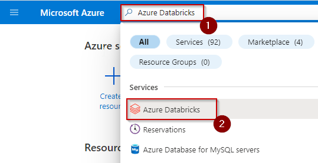

3. In the **Azure Databricks** page, select the resource that has a name starting with **databricks**.

*Note: Each student has their own unique instance of this resource. Each Azure Databricks workspace is provisioned with a full-featured development environment.*

4. In the Azure Databricks resource page, select **Launch Workspace**.

*A new web session (tab) opens.*

*You will now export a Databricks notebook in HTML format to your local machine.*

5. In the Databricks web session (tab), at the left, select the Workspace icon (second from the top).

6. Select **04_SQL_Analytics_On_Delta_Live_Tables** notebook in Databricks workspace.

7. Review cmd 4 cell.

**Raw Twitter Data - Bronze**

*The bronze layer stores the raw, unprocessed data from Twitter API pulls. By leaving it in its raw state, there's an option to reprocess it for different purposes in the future. Thanks to Azure Data Lake Gen2, it is possible to maintain this data for as long as possible at a very low costs.*
*The bronze layer is usually the domain of data engineers who build pipelines to refine this data forward into the Silver layer.*

8. Review cmd 7 cell.

**Filtered Twitter Data - Silver**

*In the Silver layer, the raw Twitter data is curated into something more usable for data scientists.*
*They can take these cleaned up data and develop features for machine learning models as well as aggregated analytical datasets for data analysts*.

9. Review cmd 9 cell.

**Curated Twitter Data - Gold**

*The Gold layer is to enhance and refine the silver layer data ets even further so that it is ready for fit-for-purpose tables and views for specific analytical needs.*
*Here we've augmented the Twitter data with a machine learning model to identify the sentiment (positive, neutral, or negative) of each Tweet.*

10. Review cmd 11 cell.

**Aggregations Are A Great User Experience Enhancement**

*By pre-emptively aggregating the data that rarely or slowly changes, it provides a great performance benefit to the end users.*
*The DLT pipeline performs this aggregation of hashtag counts by the geolocation of the Tweets.*
*By updating this everytime more Tweets are ingested, it is possible to keep the aggregation table up-to-date and then quickly consume and visualize it in tools like Power BI.*One nice feature of Databricks notebooks is if a cell produces a DataFrame output (like the one below), you can also profile the data as well as generate quick visualizations. Throw in Markdown and comments and notebooks are a super convenient way to collaborate and communicate with your team, leadership, customers, and other stakeholders.

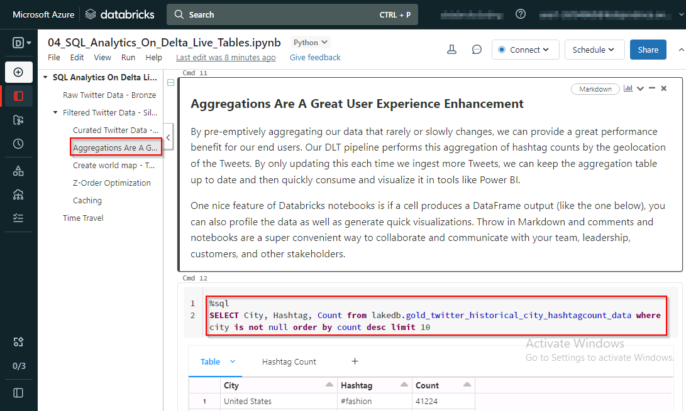

11. Review cmd 20 cell.

**Z-Order Optimization**

*Z-Ordering is a technique to co-locate related information in the same set of files.*
*This co-locality is automatically used by Delta Lake on Databricks data-skipping algorithms.*
*This behavior dramatically reduces the amount of data that Delta Lake on Databricks needs to read.*

12. Review cmd 22 cell.

**Caching**

*Caching reduces scanning of the original files in future queries. It caches contents of a table in Apache Spark cache. If a query is cached, then a temperoray view is created for this query.*

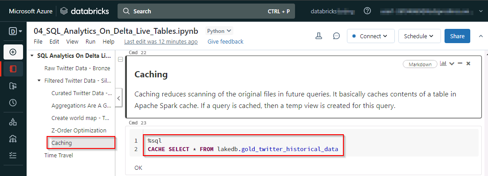

13.  Review cmd 24 cell.

**Time Travel**

*In the audit history it is possible to see the history of the different versions of the table as well as load and display of any of those versions.*

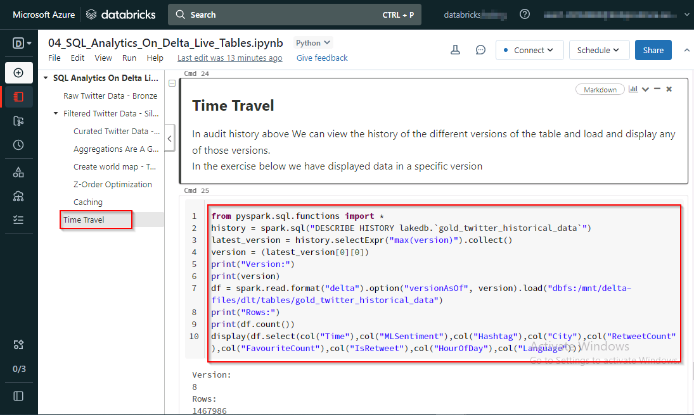

---

### Exercise 4: Glimpse of Purview to govern the overall data and analytics estate. 

  

In Exercise 1, you loaded raw data into the Lakehouse. Then, in Exercise 2, you used a Delta Live Table pipeline to transform it into a data product for downstream consumption by analysts. 

In Exercise 3, you applied machine learning operations on this data product to build a customer sentiment model. This sentiment analysis allows Wide World Importers to determine which hashtags are trending so they can customize their campaigns to improve their sales while retaining their existing customers.

Meanwhile, Microsoft Purview provides a unified data governance service that helps manage and govern Wide World Importers’ data, which is stored in multi-cloud environments and in data sources such as Oracle, Teradata, ADLS Gen2, and Azure SQL Database.

In this exercise, you will explore Wide World Importers data estate that’s registered in Microsoft Purview.

1.	In the Azure portal web session (tab), in the search box (located across the top of the page), enter:**Microsoft Purview**.

2.	In the search results pane, select **Microsoft Purview accounts**.

3.	In the **Microsoft Purview accounts** page, select the resource that has a name starting with **purviewignite**.

>**Note:** Each student has their own unique instance of this resource.

4.	In the Microsoft Purview accounts resource page, in the **Open Microsoft Purview Governance Portal** tile, select the **Open** link.

*Microsoft Purview Governance Portal opens in a new web session (tab).*

5.	In the Microsoft Purview Governance Portal web session (tab), select the [**Documentation** link](https://docs.microsoft.com/en-us/azure/purview/use-azure-purview-studio)

6.	Review the documentation available to support you setting up and working with Microsoft Purview.

*The Microsoft Purview documentation can help you learn how to:*

- Create a holistic, up-to-date map of your data landscape with automated data discovery, sensitive data classification, and end-to-end data lineage.
- Enable data curators to manage and secure your data estate.
- Empower data consumers to find valuable, trustworthy data.

7.	In the Microsoft Purview Governance Portal web session (tab), at the left, select the **Data map** icon (the second icon from the top).

*Data map makes your data meaningful by graphing your data assets and their relationships across your data estate. Use data map to discover data and manage access to that data.*

8.	In the left pane, select **Sources**.

9. In the map view, for the root collection item, select the plus (+) icon to reveal the collections.

10.	Expand each of the collections to review specific sources related to those collections.

>**Note:** For a detailed interactive experience with Microsoft Purview, please refer to the Purview Lab.
----

That is how you as Data Engineers have helped Wide World Importers gain actionable insights from its disparate data sources, thereby contributing to future growth, customer satisfaction, and competitive advantage.

  

---