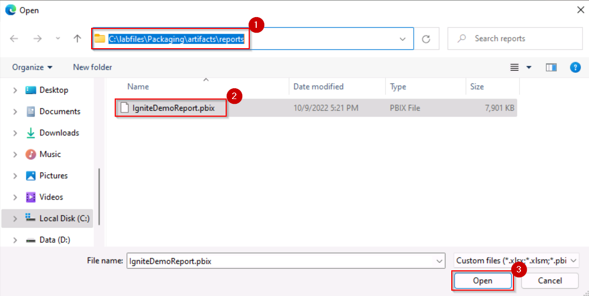
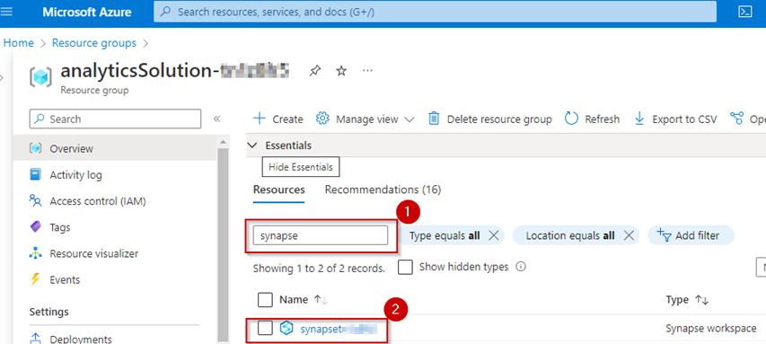

# Build an open standard data Lakehouse by using Azure Synapse Analytics and Azure Databricks

**The estimated time to complete this lab is 60 minutes.**

  

  

## Table of contents

1. [Exercise 1: Data ingestion from spectrum of analytical and operational data sources into the Lakehouse ](#data-ingestion)
	- [Task 1.1: Explore a Streaming data and analytics pipeline using ADX and Event Hub for a NRT (near real time) analytics scenario.](#streaming-data)
	- [Task 1.2: Explore a few Synapse pipelines that ingest data from analytical data sources to the Bronze layer of the lake.](#analytical-sources)
	- [Task 1.3: Explore a few Synapse pipelines that ingest data from operational data sources to the Bronze layer of the lake.](#operational-sources)
2. [Exercise 2: Explore offline data and analytics pipeline using ADB Delta and Delta Live Tables. Land data from streaming pipe in the Lake and connect with non-streaming data to build a simple Lakehouse to serve Exercise 3. ](#delta-live-table-pipeline)
3. [Exercise 3: Data Science and Analytics on the Lakehouse](#data-science-and-analytics-on-the-Lakehouse)
	- [Task 3.1: Explore an ML model implemented using ADB managed MLflow and operationalized as an ML service using MLOps in Azure ML/AI. ](#ml-model-using-ml-flow)
	- [Task 3.2: Implement a Power BI report to analyse data in the Lakehouse. ](#power-bi-report-to-analyse-data-in-the-Lakehouse)
	- [Task 3.3: Explore SQL Analytics with Synapse Serverless SQL pool.](#sql-analytics-with-synapse)
	- [Task 3.4: Explore SQL Analytics with Azure Databricks.](#explore-sql-analytics-with-azure-databricks)
4. [Exercise 4: Tee up the Purview](#tee-up-the-purview)  

----

This lab explores an end-to-end implementation of an open standard data Lakehouse. You have the opportunity to explore raw data ingestion from disparate data sources that transforms data by using Delta Live Tables in Azure Databricks. The ingestion creates data products that can be further leveraged by data science, machine learning, and business intelligence applications.
This lab will demonstrate the capability of Lakehouse to serve as a single platform for managing and supporting data and analytics needs.
You will work through an example of a real world implementation for the fictitious Wide World Importers Enterprise.

Wide World Importers is a brick and mortar retailer that has hundreds of stores worldwide and a fast-growing online store. It sells a wide variety of consumer merchandise, including sunglasses, sports shoes, watches, wallets, books, and various beach products.

The lab scenario starts on May 30th, 2021. The company's new CEO, April, recently noticed negative trends in their KPIs, including:

- High customer churn
- Declining sales revenue
- High bounce rate on their website
- Poor customer experience

In a purely reactive mode, as soon as the company saw these adverse KPI trends, they launched some traditional campaigns. On September 5 (Labor Day), the results of those campaigns were received. The company noticed that the campaigns failed to be effective.

So, April talked with Rupesh, the chief data officer (CDO), about these adverse KPI trends and recommended a data-driven approach.

In this Exercise you will act as a Data Engineer. Rupesh would like you to improve the above KPIs using the following requirements:

- Leverage data from the past, present, and future (Volume).
- Enable quick turnaround time (Velocity).
- Support open standards data format (Variety).

..
  
---
 

### Exercise 1: Data ingestion from spectrum of analytical and operational data sources into the Lakehouse 

As the data engineer at Wide World Importers, you will start by landing data from a variety of sources into the Lakehouse. This data will be further cleansed, processed, and conformed by using Azure Databricks and Delta Live Tables. You will prepare the data for downstream consumption by data scientists and business intelligence analysts. Data sources include data related to its customers, products, marketing campaigns, social media, and sales transactions. This data is often generated in raw files format such as CSV, JSON, unstructured files, and even images. A lot of existing data is historical data.

To boost customer satisfaction, gain a competitive advantage, and ultimately drive revenue growth, Wide World Importers wants to analyze the data to obtain meaningful insights related to their customers, marketing campaigns, and sales forecasts. However, their immediate challenge is to generate and use near real-time streaming data. So, they installed IoT devices in their stores to track customer shopping patterns and thermostat readings. They also set up Azure Data Explorer (ADX) with anomaly detection to correlate in-store traffic and store temperatures. As a result, they now have a large volume of real-time streaming data related to in-store traffic, temperature readings and anomaly detection.

In this exercise, you will explore how to ingest near real-time data into the Lakehouse and derive meaningful insights.

#### Task 1.1: Explore a Streaming data and analytics pipeline using ADX and Event Hub for a NRT (near real time) analytics scenario. 

Wide World Importers wants its customers to have a pleasant in-store shopping experience. Maintaining the optimal temperature in stores and wine coolers is one way to accomplish this objective.

Consider that the Black Friday Sale in-store event has just started at 6:00 AM EST, and customers are arriving in large numbers at the Miami store. As described earlier, thermostat data from the stores is streamed in real-time to an Azure Event Hub and then into an Azure Data Explorer (ADX) pool for analysis.

In this task, you will use ADX to explore thermostat data from the stores streamed in near real time to an Azure Event Hub.

1.	Open Edge.

2.	Navigate to Azure Portal at https://portal.azure.com/

3.	Under the **Resources** tab, you will find the login credentials for your lab session. 

4.  Use the **Username** and **Password** to log into the Azure Portal.

4.	If prompted to stay signed in, select **Yes**.

  

5.	If prompted to take a tour, select **Maybe Later**.

 

 6. In the search results pane, select **Resource groups**.

7. In the **Resource groups** page, in the filter box, enter: **analyticsSolution**.

8.	In the filtered results, select the resource group that has a name starting with **analyticsSolution-**.

  >**Note:** Each student has their own unique instance of this resource.

9. In the resources filter box for resources, search for **app**.

10. In the filtered results, select the App Service.

11. Select **Browse** (on the top left )

*This action will start the data simulation required to execute this task successfully*.

>**Note:** You will be redirected to a new web session (tab) with the **error 404 (Page Not Found)** .

12. Return to the Azure Portal session.

12.	In the resources filter box for resources, search for **Synapse**.

13.	In the filtered results, select the Azure Synapse resource.

*Note: You might see Synapse workspace resource name with a different suffix in your Azure Portal.*

14. In the Open Synapse Studio tile, select the Open link.

>**Note:** Synapse Studio opens in a new web session (tab).

15.	In Synapse Studio, at the left, select the **Data** hub icon (the second from the top).

16.	In the **Data** pane, expand **Data Explorer Databases (Preview).**

17.	Expand the **ignitekustopool** Data Explorer pool.

18. Select the **ellipses** (the three dots next to the data explorer pool).

19. Select the **Open in Azure Data Explorer**.

*This will open Azure Data Explorer in a new web session (tab).*

*For this lab, an ADX pool has already been created in the Azure Synapse workspace.*

*By using ADX’s powerful Kusto Query Language (KQL), you can inspect your temperature data for anomalies. You can also ensure that the thresholds you have set for each device in the store is being honored.*

>**Note:** Other Azure services use KQL for analytical queries. These services include Azure Monitor logs, Application Insights, and Microsoft Defender for Endpoint.

22.	Hover the cursor over the URI property, and then select the **Copy** icon to copy the URI to the clipboard.

23.	To open **Data Explorer Studio**, open a new web session (tab).

24.	In the new web session (tab), paste the URI into the address bar, and then press **Enter**.

25.	In Azure Data Explorer Studio, in the left pane, select the **Data** hub icon.

26.	In the **Data Management** page, select the **Ingest data** action.

27.	In the **Destination** tab, in **Cluster** dropdown list, select the Data Explorer pool.

      >**Note:** If you do not see any Data Explorer Pool in **Cluster** dropdown, select **Add Cluster**.

      > 
	  
	  > Navigate to your Synapse tab, click on manage tab, click on data explorer pools, click on the igniteKustopool, copy the ingestion url.
	  
	  > 
      
	  > Go back to the data explorer tab, in the **Connection URI**, enter the URI copied above.

      > Select **Add**.

      > 
          

28.	In the **Table** box, enter **Thermostat**.

29.	Select **Next: Source.**

30.	In the **Source** tab, in the **Source** dropdown list, select **Event Hub**.

31.	In **Subscription** dropdown list, select your subscription.

32.	In the **Event Hub namespace** dropdown list, select Event Hub that has a name starting with **adx-thermostat-occupancy-**.

33.	In the **Event Hub** dropdown list, select **thermostat**.

34.	In **Data connection name** dropdown list, select **IgniteDB-thermostat**.

35.	In the **Consumer group** dropdown list, select **$Default**.

36.	In **Compression** dropdown list, select **None**.

37.	Select **Next: Schema**.

38.	In the **Schema** tab, wait until the data preview loads (about 20 seconds).

39.	Review the event data, which comprises thermostat measures from different devices.

40.	In the **Data** format dropdown list, select **JSON.**

41.	Select **Next: Start ingestion.**

42.	Confirm that the continuous ingestion from Event Hub has been established, and then select **Close** (located at the bottom of the page).

43. Return to the Synapse Studio web session (tab).

44. In Synapse Studio, at the left, select the **Develop** hub icon (the third from the top).

45. In the **Develop** pane, expand **KQL scripts**.

46. Select the **ThermostatOccupancyScript** script.

47. In the **Connect to** dropdown list, select the data explorer pool.

48. In the **Use database** dropdown list, select **IgniteDB**.

49.	Select the query (lines 4-8) that is commented as **What is the average temp every minute?**.

*The query retrieves the average temperature per minute for Miami store device (TH005).*

50.	Select **Run**. 

51.	In the **Results** pane (located along the bottom), review the query result expressed as a chart.

52.	Notice that the temperature in the Miami store is oscillating between 66 and 68. Also notice that, thanks to ADX, and anomaly detection: As soon as the in-store traffic causes any unanticipated spikes in temperature, store temperatures are automatically cooled down for a more pleasant shopping experience. Through continuous temperature monitoring Wide World Importers are able to improve their in-store customer shopping experience.

---

  

#### Task 1.2: Explore a few Synapse pipelines that ingest data from analytical data sources to the Bronze layer of the lake. 

  
Now that you have helped Wide World importers ingest real-time data into the Lakehouse, it has enabled a pleasant shopping experience for their customers during the Thanksgiving sale, your next challenge is to ingest historical data. To do that, consider what happened on September 5, 2021, the day when the traditional campaigns failed. On this day, a lot of historical raw data came from various operational and data analytics sources into the data lake. This data came from both traditional relational and analytical databases, as well as structured files such as CSV, semi - structured files such as JSON, and even unstructured binary files such as images and PDFs.

Some of the data subject areas that you will ingest into the Lakehouse for analysis will be campaign data from Snowflake, in-store transactional data from Azure SQL Database, online sales data from Oracle, and churn data from Teradata. You will now explore some Azure Synapse pipelines that enable ingestion of data from these historical sources to the Bronze layer of the Lakehouse (ALDS Gen2).

In this task, you will explore the design of two Synapse pipelines that are designed to ingest raw data coming from various analytical sources into the data lake.

1. Return to the Synapse Studio web session (tab).

2. In Synapse Studio, at the left, select the **Integrate** hub icon (the forth from the top).

3. In the **Integrate** pane, expand **Pipelines**.

4. Expand the **1 Enterprise Data Sources In The Lake** folder.

5. Expand the **Landing Analytical Store Data** folder.

6. Select the **Campaigns Data From Snowflake** pipeline.

*The ***Campaigns Data from Snowflake*** pipeline has two activities. The first one runs a lookup of data at the source Snowflake connection. The next activity brings that data into the Bronze layer in ADLS Gen2.*

7.	In the pipeline designer, select Lookup activity.

8.	In the pane below, select the **Settings** tab.

9.	In the **Source dataset** dropdown list, notice that **SnowflakeTable** is selected.

10.	In the pipeline designer, select **Copy data** activity.

11.	In the pane below, select the **Sink** tab.

12.	In the **Sink dataset** dropdown list, notice that **SnowflakeCampaignsData** is selected.

*Similarly, another pipeline is designed for Customer churn data from Teradata.*

>**Note:** The image is for informational purposes only. Due to time constraints, we may not be able to explore it in the lab.

----

  

#### Task 1.3: Explore a few Synapse pipelines that ingest data from operational data sources to the Bronze layer of the lake. 

  
In this task, you will explore the design of two Synapse pipelines that are designed to ingest raw data coming from various operational sources into the data lake.

1.	In the **Integrate** pane, in the **Landing Operational Store Data** folder, select the **Store Transactions Data from SQL DB** pipeline.

*The **Store Transactions Data from SQL DB** pipeline has two activities. The first one runs a lookup of data at the source Azure SQL Database connection. The next activity brings that data into the Bronze layer in ADLS Gen2*.

2.	In the pipeline designer, select the Copy data activity.

3.	In the pane below, select the **Sink** tab.

4.	In the **Sink dataset** dropdown list, notice that **DestinationDataset** is selected.

*Similarly, another pipeline is designed for Sales data from Oracle.*

>**Note:** The image is for informational purposes only. Due to time constraints, we may not be able to explore it in the lab.

Congratulations! As data engineers you have successfully ingested streaming real time as well as historical data for Wide World importers.

-----------

### Exercise 2: Explore offline data and analytics pipeline using ADB Delta and Delta Live Tables. Land data from streaming pipe in the Lake and connect with non-streaming data to build a simple Lakehouse to serve Exercise 3. 
Analyzing disparate data sources in an integrated way has been a challenge for Wide World Importers. In the past, different teams at the company were assigned to analyze customer churn, social media trends, marketing campaigns, and sales forecasts. So, it was left to business analysts and executives to synthesize these datasets into a data-driven decision making solution. By delivering a Lakehouse with Azure Databricks and Azure ML, it will become simple for teams to collaborate on a unified workspace to process, analyze, and model data.

In this exercise, you will stitch sets of data together to support meaningful insights. You will set up an Azure Databricks Delta Live Table (DLT) pipeline to build a simple Lakehouse. The pipeline will enrich the data by scoring it with machine learning models to help better understand customers and how to improve service.

The data source for the pipeline is the Bronze layer in ADLS Gen2, which was loaded by the Synapse pipeline in Exercise 1. This layer stores Twitter messages, customer subscription data, traditional campaigns data (which failed on September 5), and store transactions data.

#### Task 2.1: Set up Azure Databricks environment

In this task, you will set up the Azure Databricks environment.

1.	In the Azure portal web session (tab), in the search box (located across the top of the page), enter: **Azure Databricks**

2.	In the search results pane, select **Azure Databricks**.

3.	In the **Azure Databricks** page, select the resource that has a name starting with **databricks**.

>**Note:** Each student has their own unique instance of this resource. Each Azure Databricks workspace is provisioned with a full-featured development environment.

4.	In the Azure Databricks resource page, select **Launch Workspace**.

*A new web session (tab) opens. You will then set up the Databricks compute ready to serve your workload.*

>**Note:** If you are see an error, refresh the page. Continue to sign in with the credentials provided to you.

> 

5. Observe the **ADB_Initial_Setup** workspace.

*Executing this script will mount ADLS Gen2 to Azure Databricks.*

#### Task 2.2: Execute sentiment analysis model training

In this task, you will explore the sentiment analysis model training notebook. This notebook is used to retrieve the model ID that’s used by the DLT pipeline for further data processing.

*Sentiment Analysis is a branch of Natural Language Processing where the text is contextually mined to identify and extract subjective information in source material to understand whether the underlying sentiment is positive, negative, or neutral.*

1.	To open a different workspace, at the left, select the **Workspace** icon.

2.	Select the **02_Twitter_Sentiment_Score_Pred_Custom_ML_Model** workspace.

*Running this script will generate the ML model ID.*

> **Note:** This image is for informational purposes only. Due to time constraints, we will not run this notebook in the lab session.

#### Task 2.3: Create a Delta Live Table pipeline

In this task, you will learn to create a Delta Live Table pipeline.

*Azure Databricks Delta Live Tables (often referred to as DLT) is the choice of compute engine for code-first transformation. Once the data is curated, purpose-built engines can be further utilized, enabling a single source of data accessible by each engine/compute head.*

1.	At the left, select the **Workflows** icon (the last icon).

2.	Select the **Delta Live Tables** tab.

3.	Select **Create Pipeline**.

4.	In the **Create pipeline** window, in the **Pipeline name** box, enter a name like **Delta Live Table Pipeline**.

5.	To set the **Notebook libraries** property, select the notebook icon (at the left).

6.	In the **Select a notebook** window, select the **03_Sentiment_Analytics_On_Delta_Live_Tables** notebook.

7.	Select **Select**.

*Similarly, we can add the other three notebooks.*

- 01_campaign_analytics_DLT
- Campaign Powered by Twitter
- Retail Sales Data Prep Using Spark DLT

  >**Note:** Due to time constraints, we have already added these notebook libraries to the pipeline.
        
8.	In the **Storage location** box, enter: **/mnt/delta-files/dlt/**

9.	In the **Target** box, enter: **lakedb**

10. Select **Create**.

*Selecting **Start** will start creating the pipeline. The job completes takes approximately 7-10 minutes.*

> **Note:** The following instructions are for informational purposes only. Due to time constraints, we will not start the pipeline in the lab session.

*You have now added the ML notebooks to the DLT pipeline.*

This pipeline is based on the medallion architecture, an extremely simple but powerful design pattern for organizing your Lakehouse.

“Bronze” data is usually raw, unprocessed data from source systems.

“Silver” data is created by cleaning and organizing raw data for further analysis and exploration.

“Gold” data are the finished analytical products – star schema tables for BI applications, engineered features for ML models, and shareable data assets for third parties, Data Mesh architectures, and other downstream consumers.

As you can see in this diagram, all the data is first landed in the Lakehouse where it is further processed into different medallion layers as discussed earlier.

The Twitter sentiment and campaigns data is stitched together to create a combined data product which is further consumed in the next exercise for ML and BI use cases.

All the tables and machine learning models created in Azure Databricks are governed in Databricks' Unity Catalog, which captures lineage, metadata, access controls, and a full audit history.

This information can then be piped into Microsoft Purview as part of an overall view of your Azure data estate. By being designed around simplicity, openness, and collaboration, the Lakehouse is an extremely powerful architecture for addressing the many unique and interesting problems of a modern cloud data stack ready to be leveraged by Wide World Importers.

11. **Observe** the data lineage of Bronze, Silver and variety of Gold tables.

Congratulations! As data engineers, you have now set up a solid foundation of fully stitched data comprised of historical and streaming realtime data from disparate sources including some key data transformations.

----

### Exercise 3: Data Science and Analytics on the Lakehouse 

Architecture diagram shows the end-to-end MLOps pipeline using the Azure Databricks managed MLflow. After multiple iterations with various hyperparameters, registered the best performing model in Databricks MLflow model registry and set up model serving in Azure Databricks Workspace and Azure ML Workspace for low-latency requests.
  

 

**Steps:**
  

In Azure Databricks everything starts with setting up a workspace. You can access all your Databricks assets using the sidebar. The sidebar’s contents depend on the Selected persona: Data Science & Engineering, Machine Learning, or SQL.
  

1. **Select** persona: Machine Learning
  

  

By default, the sidebar appears in a collapsed state and only the icons are visible. Move your cursor over the sidebar to expand to the full view.
  

2. **Navigate** to the “ML Solutions in OneBox” notebook.
  

  
A Databricks cluster is a set of computation resources and configurations on which you run data engineering, data science, and data analytics workloads, such as production ETL pipelines, streaming analytics, ad-hoc analytics, and machine learning.
    

3. **Navigate** to **Requirements** in cmd 3.
  

  

In this cell we install all the dependencies required by the notebook.

  
The customer churn data is coming from teradata (external storage) to Azure data lake storage (ADLS). then we are loading customer subscription data to ADB Delta table.

Let's start by examining the customer churn effect on the tenure of the month and the total amount spent. As a result, can see the low churn rate if customer tenure is high and they spend more amount.
  

4. **Navigate** to **Exploratory Data Analysis** in cmd 11.
  

  

5. **Navigate** to cmd 23, cmd 24 and cmd 25.

  

We will use the popular xgboost library to train a more accurate model. One way to improve a model’s perfomance is to test different hyperparameters. Rather than doing this through trial and error, Databricks is able to use a “parallel hyperparameter sweep” to train multiple hyperparameter configurations at the same time, using Hyperopt and SparkTrials. As before, the code tracks the performance of each parameter configuration with MLflow.
  

6. **Point** to cmd 29.
  

  

You can visualize the different runs using a parallel coordinates plot, which shows the impact of different parameter values on a metric here.

  
7. **Go to** cmd 27 and cmd 28  to retrieve the **best run**.

  

>**Note**: Because all of the runs are tracked by MLflow, you can retrieve the metrics and parameters for the best run using the MLflow search runs API to find the tuning run with the highest AUC. 
 

The code finds the best performing run and saves the model-to-Model Registry. In this case, AUC is a primary metric, and the best-performing model is Selected for production deployment. If the latest model performs better than earlier deployed models, the new model is deployed to the production environment and the old model gets archived. If the latest model gives a lesser AUC score, then the previously deployed model remains in the production environment. 

8. **Go to** cmd 30, cmd 31 and cmd 32 to register model in **Model Registry**.
   

Before we can invoke the model from Databricks using a REST endpoint, we need to enable the endpoint. 

Once we have registered the model and enabled serving, we can then call on it using an endpoint and an access token.
  

9. **Go to** to cmd 38 to show making request to the **model endpoint**.

  

  

**Operationalized as an ML service using MLOps in Azure ML/AI**.

10. **Navigate** to cmd 44 to load Azure ML Workspace.
  

This cell shows model being registered in aml workspace. 

11. **Go to** to cmd 55 to register model in Azure ML workspace.
  

Deployments can be generated using both the Python SDK for MLflow or MLflow CLI. In both cases, a JSON configuration file can be indicated with the details of the deployment you want to achieve. If not indicated, then a default deployment is done using Azure Container Instances (ACI) and a minimal configuration. 

The MLflow plugin azureml-mlflow can deploy models to Azure ML, either to Azure Kubernetes Service (AKS), Azure Container Instances (ACI) or Managed Endpoints for real-time serving. 
 

12. **Review**  cmd 58 to deploy registered model in Azure Managed Endpoints for real-time serving.

We can validate that our Azure ML endpoint is up and running by submitting a test input. Inputs should be submitted inside a JSON payload containing a dictionary with key input_data. 

13. **Navigate** to cmd 61 to get **Predicted Churn** from **Azure ML Endpoint**.

**Twitter Sentiment Score Custom ML Model** 

14. **Expand** sidebar, **Collapse** Customer Chur Model. and **Select** Twitter Sentiment Score Model.

We are building an XGboost model and logging our experiment run using MLflow. This will allow us to pick the best model from our training runs.  

15. **Go to** cmd 74 to see train custom twitter model configuration.

16. **Navigate** cmd 74 to check ML model pipeline setup.

17. **Navigate** to cmd 75 for custom model train and validation.

18. **Go to** cmd 77 and cmd 79 to save model run id in a **VIEW** that can be used in another notebook. 

**Campaign Analytics**  

19. From the sidebar **Select** Campaign Analytics.

We can see the data that we have available after we have run the campaign on Twitter. We can perform some analysis on this data 

20. **Navigate** to cmd 88.

By aggregating our dataset, we can get insights on different scales. In this case we are investigating the revenue per country/region 

21. **Navigate** to cmd 91.

We can also use Structured Streaming to perform aggregations over a sliding event-time window. 

22. **Navigate** to cmd 94 and cmd 95.

**Sales Forecasting** 

23. From the sidebar **Select** Sales Forecasting.

We will now be looking at the scenario where we are forecasting sales using a Regression model and deploying it to Azure ML as a service using a model registered in Azure Databricks.

Before we can build our model, we need to load our data from the database using a SQL query. 

We split our data into training and test datasets for future use, we can save them as delta tables in Databricks.

24. **Navigate** to cmd 108 to Load the Dataset from table.

Now that we have done our pre-processing, we can move onto building and deploying our machine learning model on Azure ML.

25. **Point** to cmd 115 to build a Regression model using SKlearn, and log our run using MLflow to track model performance metrics.

Ensure the model is registered in Azure Machine Learning registry. Deployment of unregistered models is not supported in Azure Machine Learning. You can register a new model using the MLflow SDK. 

26. **Go** to the cell 119 and cmd 120 to register model in AML workspace.

Once the model is trained and registered, we can create a deployment in Azure ML to serve the model via a REST API. This will allow us to operationalize our model and serve it to a wider audience.

27. **Point** to the cell 127 where model deployment is being created.

Data stored in a Databricks Delta Table is a secure csv file format that is an encoded layer over data. These stale data files and logs of transactions are converted from ‘csv’ to ‘ Delta ’ format to reduce custom coding in the Databricks Delta Table. 

28. **Navigate** to Cmd 129 to see **sales forecasting**.

29. **Point** to cmd 133 to see sales forecast using store data after campaign 

----------

#### Task 3.2: Implement a Power BI report to analyse data in the Lakehouse. 

 For the purposes of this task, the date is November 1. Wide World Importers now needs to prepare for a resounding success with unprecedented sales in the upcoming Cyber Monday Sales event. The good news is that enriched datasets sourced from disparate data sources and the best performing model outputs have now been placed in the lakehouse ready for consumption by Power BI.

In this task, you will work with Power BI to reveal valuable insights for Wide World Importers.

1.	Open a new web session (tab), and then navigate to: **https://powerbi.com**

2.  If prompted, enter the email account provided to you, and then select **Submit**.

*You may be redirected to a set up page.*

3. If prompted, in the **Business phone number** enter:**1234567891**, select **Next**.

>**Note:** **DO NOT** check the checkbox at the bottom of the page.

3.	If prompted, select **Get Started**.

*You have now signed in to Power BI.*

4. In the Power BI service, in the **Navigation** pane (at the left), select **Workspaces** (second icon from the bottom).

5. In the workspaces pane, select **My Workspace**.

8. To upload a Power BI Desktop file, on the **New** dropdown menu, select **Upload**.

9.	Select the **Local File** tile.

10.	In the **Open** window, navigate to the **C:\labfiles\Packaging\artifacts\reports** folder, and then select the **IgniteDemoReport.pbix** file.

11.	Select **Open**.

12.	Notice that a Power BI report and dataset have been added to your workspace.

14.	To open the report, select the **IgniteDemoReport** report.

 27. The report has 3 sections,
 - Customer Churn Report
 - Campaign Analytics
 - Website Analytics
 

1.  Lets navigate to **Churn Analysis Tab,** we analyze the Customer Churn for World Wide importers customers. Here we can see  the probabilty of customer churn is based on two factors. Namely, the tenure of the customers and their purchase amount.

  

2.The top left Scatter Chart shows the Customers, the black color in the legend represents the Customers who are more likely to Churn, and the blue color shows Customers who are less likely to churn.

3.Here we can we can see on the scatter plot chart that most of their loyal customers are those who have been shopping with them for a longer period of time and who also spend larger amounts. On the other hand, we see that most of the customers who are likely to churn are those with lesser tenure (or shopping history) and also lower purchase amount.  
With this insight, it is clear to Wide World Importers, that in order to have a successful CyberMonday Sale event, they need to attract newer customers who spend lesser. They also need to know more about where the most customer churn is happening and leverage the lessons learned from their campaigns to target this population of customers. Let's see first where the churn is happening.    

4.**Point** towards the bottom right Bar Chart.

The bar chart explains the probability of customer churn depending on various conditions. We see a few more factors now affecting customer churn. Namely, the online delivery channel and customers who had to interact with customer support. So, that answers where the churn is happening. It seems the highest churn is in their online channel! They need to fix that quickly before the CyberMonday event! To do that, they need to launch new campaigns based on lessons learned from the prior failed campaigns on Sep 5th. Let's see what those prior campaigns revealed...
 

  
  

5.  **Point** towards the word cloud, to show the hashtag size based on the revenue generated through the campaign. It is obvious that the largest revenue generated can be attributed to #GoGreen and #SustainableFashion. But let us re-confirm that based on the number of tweets for those hashtags...

6.  **Point** towards the Bar chart, to show the number of tweets by hashtags.

Here on this  bar chart most popular hastags with most tweets on twitter are ‘**GoGreen’** and **'sustainable fashion’**. So that confirms our insight from this data is that most of the customers are environmentally conscious and want to purchase climate friendly green products which are sustainable as well.
  
So, armed with all this information, Wide World Importers launches new campaigns to attract customers who have lesser tenure, spend lesser and who prefer the online channel and are also environmentally conscious. The outcome? Let us see next!

  

  Here we see our new campaigns data and get even more insights 

1.  **Click** on the Campaign Analytics tab from the top right pane to navigate to the Campaign Analytics report.
  

Here on this Campaigns report, from the Bar chart we can obviously see our most popular campaings launched are ‘gogreen’ and  ‘sustainablefashion’. No surprise that these also have the highest revenue among all other campaigns we launced
These new campaigns were run by Wide World Importers globally. So, let us take a moment to see how these campaigns fared in different countries.

  

  

2.  The Donut chart shows the revenue generated by the countries after running the new campaigns. Clearly these campaigns were a huge success in USA and Germany. The prospects for CyberMonday sale are now looking even better...

  

3.  **Click** on the generations to see the branches change, and **click** on the campaign names to see the revenue.

  

Here we see another way to gather insights about their campaigns. It is by the use of a decomposition tree. This decomposition tree has different levels to show campaigns reaching different age groups through social media, events, and emails. As an illustration you can see here the revenue generated by country and campaign name. In this example, USA has generated the highest revenue when the campaign name was ‘Southbeach’ and they used social media for the outreach, and the generation was baby boomers.
Now, let us turn our attention to website analytics since that is so key for success in the CyberMonday event...
  

 

  

**Click** on Website Analytics from the top right pane to navigate to the Website Analytics Report.

Here we see an immediate issue for Wide World Importers.

  

1.Their Bounce rate is high. Looks like a large population of their customers/ visitors leave their website without much activity. They need to find out more about the root cause of this high bounce rate. So let us look at the next graph which shows the reason behind the high bounce rate...

  

Per this Donut chart it seems that the bounce rate is high because around 60 % of the online Customers are not happy. Let us understand more about these "not happy" customers. What age group are they? What do they shop for and what devices they use to shop online? 

  

3.Click on "Not Happy" on the Donut chart to filter the report page.

  

1.  The site visitor by age group chart shows that most of the "Not Happy" Customers are in the  age group of 21 to 40. So, it seems Millennials form the majority of unhappy online customers...let us see what these millenials typically shop for online...
 
 

2 . Here on this bar chart we can see which Products they are searching on the website. 

**Hover** over the bar chart to see Product Images.Here we can see most of the millennial customers are searching for beach products and adventure sports.

Now lets move on to the next chart which shows some insights about the devices used by these millennials to shop online.

1. On this column chart we can they most of our "Not Happy" Customers are browing our website on a mobile phone.
   

Now lets deep dive to get more insights about the factors which have the most occurence in groups of customers who are "Not Happy"

 1.  **Click** on the key Influencers button to navigate to the Key Influencers page.
   

 

Let's click on the dropdown and select "Not Happy" to see the factors.

 : Happy | : Not Happy

1. We can see that millennials form the biggest not happy customer segment.
2. Customers are also not happy when they could not find the product they searched for on the website.
3. Customers are also not happy when they were redirected to Wide World Importers website from a third party website.
4. Customers are also not happy whent the website user experience on their mobile phones is not good.
5. Most of the customers not happy because they are not able find discounts on the website.

Ultimately we can say that we need to improve the user experience on the Website for Product search and make sure it renders correctly on the Mobile phone.

  
 Now, another interesting angle is to see even amongst the "Not Happy" set of customers, what top segments can they focus on. Lets navigate to Top Segments for additional insights generated.

 1.  **Click** on the Top Segments to show the details.

48. **Click** on bubble 1 to see the details for segment 1.

 
 

The bubbles show the segment of the population who are not happy.

48. **Click** on bubble 1 to see the details for segment 1.
Segment 1 shows that 94.5 % of the "not happy" customers experienced failed product searches. By looking at customer segment category, these are  millennials who are using their mobile devices for shopping.

 
 
 
  Now lets click on Decomposition button to  navigate to Decomposition Tree chart

The decomposition tree which shows a similar scenario based on age group categories as to who are happy or unhappy based on various conditions.

So, thanks to Power BI, it is clear to Wide World Importers how to improve their bounce rate. They quickly implement a mobile-friendly website with super fast and convenient product search capabilities, focussing mainly on the products most in demand with millennials. These changes reduce their not happy online customers and thereby improve their bounce rate dramatically. As a result they have a resounding success with uprecedented sales at their CyberMonday Sale event. 
Now, let us see how on an ongoing basis if there are business needs to run adhoc time-critical queries, it can be achieved via custom queries. We will discuss that in more detail in the next task.  
------------- 

#### Task 3.3: Explore SQL Analytics with Synapse. 

Data Engineers are often called upon to support with adhoc and possibly time-critical queries aside from the canned reports we have discussed so far.
So, let us see how Azure SQL Analytics can also perform custom SQL and BI workload on the data lake in addition to supporting the reports discussed thus far. In this exercise, we will query the data from Data Lake using Azure Synapse Analytics.

Synapse serverless SQL pools is a service to query data in data lakes. Key is that data can be accessed without the need to copy data into SQL tables. Typically, serverless pools are not used to serve external APIs.
Here are the steps involved...

**Steps:**

1. **Search** “Synapse Analytics”.

2. **Click** on Azure Synapse Analytics.

3. **Click** on Synapse workspace shared with you.

>**Note**: You might see Synapse workspace name with different suffix in your Azure Portal.

4. **Click** on **Open** Synapse Studio.

Welcome to **Azure Synapse Analytics!**

In Azure Synapse, we can use T-SQL to directly query data within a data lake for rapid data exploration.

To enable easy exploration and transformation of data in our data lake we can use a serverless SQL pool.

5. **Click** on Develop hub.

6. **Expand** SQL scripts section.

7. **Select** SQL scripts ‘1 Query Campaign And Twitter Data Using TSQL’.

We can directly query external files stored in Azure storage without copying or loading data into a specialized store, all using familiar T-SQL dialect.

A default, built-in, endpoint for this service is provided within every Synapse workspace.

8. **Select** TSQL script.

9. **Connect** with Serverless pool 'IgniteServerlessPool'.

10. **Click** on Run.

11. **View** the result.

Let’s create a view over Campaign file in Serverless pool. With the relevant metadata and placed in an Azure storage account.

12. **Select** TSQL script for creating a view.

13. **Click** on Run.

There you go. This is how easily data engineers can run adhoc time-critical queries on Synapse. We can do the same even with Databricks. Let us take a look...

#### Task 3.4: Explore SQL Analytics with Azure Databricks. 

Azure Databricks provides an environment that allows you to run quick ad-hoc SQL queries on your data lake. Queries support multiple visualization types to explore query results from different perspectives.

In this task, we as data engineers are exploring a few of the SQL Analytics features with Azure Databricks.

Here are the steps...

**Steps:**

1. **Search** “Azure Databricks”.

2. **Click** on Azure Databricks.

3. **Click** on Azure Databricks service shared with you.

4. **Click on** Launch Workspace.

5. Go to “04_SQL_Analytics_On_Delta_Live_Tables” Notebook in Databricks workspace.

6. Review Raw Twitter Data - Bronze
Our bronze layer stores the raw, unprocessed data from our Twitter API pulls. By leaving it in its raw state, we give ourselves the option to reprocess it for different purposes in the future. Thanks to Azure Data Lake Gen 2, we can maintain this data for as long as we need it at very low costs. The bronze layer is usually the domain of data engineers who then build pipelines to refine this data forward into the silver layer.

7. Scroll down to cmd 7.

**Curated Twitter Data - Silver**

In our silver layer, we've curated our raw Twitter data into something more usable for data scientists. They can take these cleaned up, detailed level tables and develop features for machine learning models as well as aggregated analytical datasets for data analysts.

8. Scroll down to cmd 9.

**Curated Twitter Data - Gold**

In our gold layer, we can enhance and refine our silver data sets even further into fit-for-purpose tables and views for specific analytical needs. Here we've augmented our Twitter data with a machine learning model identifying the sentiment (positive, neutral, or negative) of each Tweet so we can get a sense of how the Twitter tags we're analyzing are being used.

7. Scroll down to cmd 17.

**Aggregations Are A Great User Experience Enhancement**

By pre-emptively aggregating our data that rarely or slowly changes, we can provide a great performance benefit for our end users. Our DLT pipeline performs this aggregation of hashtag counts by the geolocation of the Tweets. By only updating this each time we ingest more Tweets, we can keep the aggregation table up to date and then quickly consume and visualize it in tools like Power BI.One nice feature of Databricks notebooks is if a cell produces a DataFrame output (like the one below), you can also profile the data as well as generate quick visualizations. Throw in Markdown and comments and notebooks are a super convenient way to collaborate and communicate with your team, leadership, customers, and other stakeholders.

8. Scroll down to cmd 20

**Z-Order Optimization**

Z-Ordering is a technique to colocate related information in the same set of files.This co-locality is automatically used by Delta Lake on Databricks data-skipping algorithms.This behavior dramatically reduces the amount of data that Delta Lake on Databricks needs to read

9. Scroll down to cmd 22.

**Caching**

Caching reduces scanning of the original files in future queries. It basically caches contents of a table in Apache Spark cache. If a query is cached, then a temp view is created for this query.

10.  Scroll down to cmd 24.

**Time Travel**

In audit history above We can view the history of the different versions of the table and load and display any of those versions.In the exercise below we have displayed data in a specific version
---

### Exercise 4: Tee up the Purview 

  

In Exercise 1, you loaded raw data into the Lakehouse. Then, in Exercise 2, you used a Delta Live Table pipeline to transform it into a data product for downstream consumption by analysts. 

In Exercise 3, you applied machine learning operations on this data product to build a customer sentiment model. This sentiment analysis allows Wide World Importers to determine which hashtags are trending so they can customize their campaigns to improve their sales while retaining their existing customers.

Meanwhile, Microsoft Purview provides a unified data governance service that helps manage and govern Wide World Importers’ data, which is stored in multi-cloud environments and in data sources such as Oracle, Teradata, ADLS Gen2, and Azure SQL Database.

In this exercise, you’ll explore the Microsoft Purview setup.

#### Task 4.1: Explore Microsoft Purview

In this task, you will explore the Wide World Importers data estate that’s registered in Microsoft Purview.

1.	In the Azure portal web session (tab), in the search box (located across the top of the page), enter:**Microsoft Purview**.

2.	In the search results pane, select **Microsoft Purview accounts**.

3.	In the **Microsoft Purview accounts** page, select the resource that has a name starting with **purviewignite**.

>**Note:** Each student has their own unique instance of this resource.

4.	In the Microsoft Purview accounts resource page, in the **Open Microsoft Purview Governance Portal** tile, select the **Open** link.

*Microsoft Purview Governance Portal opens in a new web session (tab).*

5.	In the Microsoft Purview Governance Portal web session (tab), select the [**Documentation** link](https://docs.microsoft.com/en-us/azure/purview/use-azure-purview-studio)

6.	Review the documentation available to support you setting up and working with Microsoft Purview.

*The Microsoft Purview documentation can help you learn how to:*

- Create a holistic, up-to-date map of your data landscape with automated data discovery, sensitive data classification, and end-to-end data lineage.
- Enable data curators to manage and secure your data estate.
- Empower data consumers to find valuable, trustworthy data.

7.	In the Microsoft Purview Governance Portal web session (tab), at the left, select the **Data map** icon (the second icon from the top).

*Data map makes your data meaningful by graphing your data assets and their relationships across your data estate. Use data map to discover data and manage access to that data.*

8.	In the left pane, select **Sources**.

9. In the map view, for the root collection item, select the plus (+) icon to reveal the collections.

10.	Expand each of the collections to review specific sources related to those collections.

*Map view shows a graphical representation of the Wide World Importers’ data estate. You can also see data assets from various collections such as Azure Synapse Analytics, ADLS, Multi Cloud, Power BI, and Azure SQL Database. A collections is a categorization of various data sources that are registered in Microsoft Purview.*

11. View the lineage of Synapse Pipeline.

*It’s only possible to view lineage after scanning the registered resource. The ability to capture lineage is key feature of Microsoft Purview.*

*In this exercise, you will look at the data lineage feature of Microsoft Purview.*

*Within the lineage visualization, each asset is represented by a rectangular box. For example, assets can include SQL tables or CSV files. Each process is represented by a rounded-edge box and includes the Azure Synapse Copy activity among others.*

*Here you can see the data lineage of the Azure Synapse, which is a registered asset in Microsoft Purview.*
>**Note:** This image is for informational purposes only.
> You will not be able tp see this in your lab.
> It will be explained to you by your lab instructor. 

>**Note:** For detailed interactive experience with Microsoft Purview, please refer the ABC Lab at Ignite.
----

That is how you as Data Engineers have helped Wide World Importers gain actionable insights from its disparate data sources, thereby contributing to future growth, customer satisfaction, and competitive advantage.

  

---